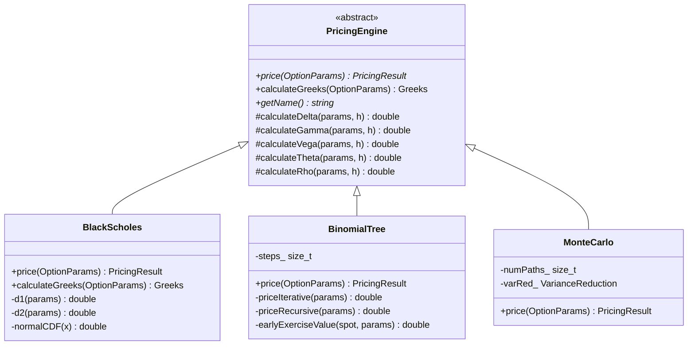

# Option Converge

[](https://en.cppreference.com/w/cpp/17)
[](https://github.com/jackthepunished/option-converge/actions/workflows/ci.yml)
[](https://cmake.org/)
[](#build-instructions)
[](#current-status)

A C++ option pricing engine built around a single abstract `PricingEngine` interface, so that
analytic, lattice, and simulation methods can be swapped, cross-checked, and compared against one
another under identical inputs.

The name refers to the central question the project is organised around: different numerical methods
approach the same option value along different paths, at different rates, with different error
characteristics. Making those paths directly comparable is the point.

---

## Project Overview

Option pricing has one closed-form answer for a narrow class of contracts (European exercise,
continuous dividends, constant volatility) and no closed-form answer for most of the rest.
Practitioners therefore maintain several numerical methods side by side and rely on the fact that,
where their domains overlap, they must agree.

This repository implements those methods behind a common interface so that the overlap is testable
rather than assumed. Black-Scholes prices a European option analytically; a Cox-Ross-Rubinstein
lattice prices the same option by backward induction and must converge to the analytic value as the
step count grows. Where the lattice diverges from the formula, one of them is wrong.

The engine is written to be read. Numerical routines are commented where the mathematics is not
self-evident, memory layouts are chosen deliberately, and the interface is narrow enough that adding
a new method means implementing three functions.

> [!NOTE]
> All three engines (Black-Scholes, binomial lattice, Monte Carlo) and both analysis tools
> (convergence, benchmarking) are implemented and build. A 105-check test suite runs under CTest.
> See [Current Status](#current-status) for the breakdown.

---

## Current Status

The table below reflects what is compiled into the library today, not what is planned.

| Component | Header | Implementation | In build | Notes |
|---|:--:|:--:|:--:|---|
| `PricingEngine` (interface) | Yes | Yes | Yes | Abstract base; finite-difference Greeks |
| `BlackScholes` | Yes | Yes | Yes | Analytic price and Greeks, European only |
| `BinomialTree` | Yes | Yes | Yes | CRR lattice, European and American |
| `Option` (types, params) | Yes | Yes | Yes | Validated parameter struct |
| `MonteCarlo` | Yes | Yes | Yes | Euler/Milstein schemes; four variance-reduction modes |
| `FiniteDifference` | Yes | Yes | Yes | Explicit/implicit/Crank-Nicolson; European and American |
| Barrier options | Yes | Yes | Yes | Reiner-Rubinstein closed forms + Brownian-bridge MC |
| Asian options | Yes | Yes | Yes | Geometric closed form; arithmetic MC with geometric CV |
| `ImpliedVolatility` | Yes | Yes | Yes | Newton-Raphson with bracketed Brent fallback |
| `ConvergenceAnalyzer` | Yes | Yes | Yes | Step/path sweeps, RMSE, CSV export |
| `PerformanceBenchmark` | Yes | Yes | Yes | Adaptive batching; comparison table; CSV export |
| Test suite (`tests/`) | — | Yes | Yes | 105 checks under CTest, no framework dependency |

---

## Features

- Abstract `PricingEngine` interface with runtime polymorphism across pricing methods
- Analytic Black-Scholes pricing for European calls and puts, with continuous dividend yield
- Cox-Ross-Rubinstein binomial lattice supporting both European and American exercise
- Early-exercise handling via backward induction with an explicit continuation-value comparison
- Analytic Greeks for Black-Scholes; finite-difference Greeks as a default for any engine
- `O(N)` memory backward induction over a rolling value vector rather than a full `O(N²)` tree
- Arbitrage checks on lattice construction (rejects step counts that produce `p ∉ [0, 1]`)
- Validated option parameters that fail fast on non-positive spot, strike, or maturity
- Timing and memory accounting captured in every `PricingResult`
- Monte Carlo with Euler/Milstein discretisation, antithetic and control-variate reduction,
  reproducible seeding, and common-random-numbers Greeks
- Asian options with discrete arithmetic and geometric averaging: exact closed form for the
  geometric contract (the geometric mean of lognormals is lognormal), used both as a test
  reference and as a control variate that collapses the arithmetic estimator's variance
- Barrier options (all four knock-in/knock-out variants): continuously monitored
  Reiner-Rubinstein closed forms, cross-validated against a Monte Carlo pricer whose
  Brownian-bridge crossing correction lets coarse paths price the continuous contract
- Finite difference PDE engine: explicit, implicit, and Crank-Nicolson as one θ-scheme on a
  log-spot grid, Thomas-algorithm tridiagonal solves, American exercise via projection, and
  automatic time-axis refinement to keep the explicit scheme inside its stability bound
- Implied volatility solver: Newton-Raphson on analytic vega, with a bracketed Brent fallback
  for the low-vega regions where Newton is unreliable, and no-arbitrage bound checks up front
- Convergence analysis and performance benchmarking with CSV export
- 105-check test suite (parity, convergence, reference values, exercise-style properties) via CTest

---

## Project Architecture

Every pricing method answers the same question — given contract parameters, what is the option
worth — but by different means. The interface encodes exactly that, and nothing else.



### Why a common interface

The interface exists for reasons that are practical rather than stylistic.

**Cross-validation.** Two engines that price the same contract by unrelated mathematics provide a
mutual correctness check. A lattice that fails to converge to Black-Scholes on a European option has
a bug, and a common interface makes that comparison a loop rather than a rewrite. This is the single
strongest argument for the design, and the one the project is named after.

**Substitutability at the call site.** Client code holds a `PricingEngine*` and does not know or care
which method is behind it. Choosing a method becomes a configuration decision — analytic when a
closed form exists, lattice when exercise is American, simulation when the payoff is path-dependent —
rather than a code change.

**Shared machinery with selective override.** Greeks are the clearest case. The base class provides
finite-difference approximations that work for *any* engine, because they only require the ability to
re-price at a bumped parameter. `BlackScholes` overrides them with exact analytic derivatives. A
lattice inherits the default. New engines get working Greeks for free, then specialise if they can do
better.

**Uniform instrumentation.** Because every engine returns a `PricingResult`, timing, standard error,
and memory usage are captured the same way everywhere, which is what makes principled benchmarking
possible at all.

```cpp
// Two engines, one loop. This is the whole argument for the interface.
for (PricingEngine* engine : {bsPtr, crrPtr}) {
    const double call = engine->price(callParams).price;
    const double put  = engine->price(putParams).price;
    // Put-call parity must hold for every European engine, whatever the method.
    check_parity(call, put);
}
```

The base class deliberately deletes its copy and move operations. `PricingEngine` is used
polymorphically through pointers and references; permitting base-class copies would invite slicing.
Derived engines, which are concrete and self-contained, re-enable copy and move.

---

## Pricing Methods

| Method | Exercise | Complexity | Deterministic | Best suited to |
|---|---|---|:--:|---|
| Black-Scholes | European | `O(1)` | Yes | Closed-form baseline; calibration inner loops |
| Binomial Tree (CRR) | European, American | `O(N²)` time, `O(N)` memory | Yes | Early exercise; discrete dividends |
| Monte Carlo | European (extensible) | `O(paths × steps)` | Per-seed | Path dependence; high dimensionality |
| Finite Difference | European, American | `O(M × N)` time, `O(M)` memory | Yes | PDE view; whole price surface per solve |

### Black-Scholes

The analytic solution to the Black-Scholes-Merton PDE for a European option on an asset with a
continuous dividend yield. Pricing reduces to two cumulative normal evaluations, so a valuation costs
a handful of floating-point operations and is effectively free.

Implementation notes: the normal CDF is computed as `0.5 · erfc(-x/√2)` rather than through a
polynomial approximation, which is both more accurate in the tails and faster in practice, since
`std::erfc` maps to a vendor-optimised routine. Values shared between the price and the Greeks
(`d1`, `d2`, `N(d1)`, `n(d1)`, the discount factors) are computed once per call.

**Use it when** the contract is European and the model assumptions are acceptable. Its real value in
a production system is as a reference: it is the ground truth against which every other engine is
validated, in the test suite and the convergence analyzer alike.

**It cannot** price American exercise, and the implementation rejects such requests explicitly rather
than returning a silently wrong number.

### Binomial Tree (Cox-Ross-Rubinstein)

The asset is modelled as a recombining lattice. Over each step of length `Δt` the price moves up by
`u = e^(σ√Δt)` or down by `d = 1/u`, under the risk-neutral probability
`p = (e^((r-q)Δt) - d) / (u - d)`. Terminal payoffs are computed at expiry and discounted backwards.

Two properties of the implementation are worth noting.

The lattice **recombines** — an up move followed by a down move returns to the same node — so the
tree has `O(N²)` nodes rather than `2^N` paths. Backward induction is performed over a single rolling
vector of node values, giving `O(N)` memory:

```cpp
for (size_t step = n; step-- > 0;) {
    for (size_t i = 0; i <= step; ++i) {
        const double continuation =
            lat.discount * (lat.p * values[i + 1] + (1.0 - lat.p) * values[i]);
        values[i] = american
            ? std::fmax(continuation, earlyExerciseValue(spotAt(step, i), params))
            : continuation;
    }
}
```

The lattice is **checked for arbitrage** at construction. If `Δt` is too coarse relative to `σ`, the
risk-neutral probability falls outside `[0, 1]` and the model admits arbitrage; the constructor
throws rather than returning a meaningless price.

**Use it when** the option is American, or when the payoff depends on the state at intermediate times
in a way the lattice can represent. The `american` branch above is the entire reason lattices remain
in production use decades after closed forms were found: early exercise requires knowing the
continuation value at every node, which is precisely what backward induction produces and what a
forward simulation does not.

**The trade-off** is a convergence rate of `O(1/N)` against quadratic cost, so squeezing an extra
digit of accuracy out of the lattice costs roughly a hundred times the work.

### Monte Carlo

The engine simulates GBM paths under the risk-neutral measure (252 steps per path, Euler or
Milstein discretisation), averages the discounted payoffs, and reports the standard error of that
mean. Four variance-reduction modes are implemented: none, antithetic variates, a control variate
on the discounted terminal price, or both combined. A fixed seed makes pricing reproducible, and
the Greeks use central finite differences under common random numbers — the same RNG state is
restored before each repricing so the sampling noise cancels in the differences.

**It is useful when** the payoff is path-dependent (Asian, barrier, lookback) or the state space
is high-dimensional, since Monte Carlo error scales as `O(1/√paths)` independently of dimension — the
one place it beats lattices and finite differences outright.

**Its weaknesses** are the same in every implementation: convergence is slow, the result is a
confidence interval rather than a number, and naive American exercise is not possible without a
regression scheme such as Longstaff-Schwartz.

### Finite Difference

The PDE view of the same problem: discretise the Black-Scholes equation on a grid and march
backward from the terminal payoff. The engine works in log-spot, where the PDE coefficients are
constant — one tridiagonal stencil serves every time step, and the grid is centred so the initial
spot falls exactly on a node, read off without interpolation.

All three classical schemes are implemented as one θ-scheme: explicit (`θ = 0`), fully implicit
(`θ = 1`), and Crank-Nicolson (`θ = ½`). Implicit steps solve the constant tridiagonal system with
the Thomas algorithm in `O(M)` per step. The explicit scheme is only conditionally stable, so the
engine refines its own time axis to keep the update coefficients positive rather than returning an
oscillating solution. American exercise applies the projection `max(continuation, intrinsic)` at
every node after each step — the same comparison the lattice makes, taken on the PDE grid.

**Use it when** exercise is American and you want a second, methodologically independent check on
the lattice, or when you want the whole price surface (every spot level, every time) from a single
solve rather than a point value.

**The trade-off**: Crank-Nicolson converges at `O(Δt², Δx²)` — better than the lattice's `O(1/N)`
per unit of work — but the payoff kink at the strike can excite oscillations that plain
Crank-Nicolson damps only slowly, and Dirichlet boundaries require the grid to be wide enough that
truncation does not leak into the region of interest.

---

## Greeks

The Greeks are partial derivatives of the option value with respect to model inputs. They matter
because nobody prices an option in order to know its price — they price it in order to hedge it. A
market maker quoting an option holds a position whose value moves with spot, volatility, time, and
rates, and the Greeks are precisely the coefficients that say how much of each risk to offset.

| Greek | Derivative | Interpretation | Hedging use |
|---|---|---|---|
| Delta | `∂V/∂S` | Sensitivity to the underlying price | Shares to hold against the option |
| Gamma | `∂²V/∂S²` | Rate of change of delta | How often the delta hedge must be rebalanced |
| Vega | `∂V/∂σ` | Sensitivity to implied volatility | Exposure to the volatility surface |
| Theta | `∂V/∂t` | Time decay | Carry earned or paid by holding the position |
| Rho | `∂V/∂r` | Sensitivity to the risk-free rate | Rate exposure, material for long-dated options |

Two mechanisms supply them:

- **Analytic** — `BlackScholes` overrides `calculateGreeks` with exact closed-form derivatives, at
  the cost of a single evaluation and with no truncation error.
- **Finite difference** — `PricingEngine` provides central-difference defaults that re-price at
  bumped inputs. Any engine inherits working Greeks without additional code. Delta, for instance, is
  `(V(S+h) - V(S-h)) / 2h`.

Delta from the 1000-step lattice agrees with the analytic value to within `9 × 10⁻⁵`, which is a
useful end-to-end check that the lattice and the formula describe the same model.

All engines use the same conventions: Vega and Rho per 1% move, Theta per calendar day. The test
suite verifies that the lattice's finite-difference Delta, Vega, Theta, and Rho agree with the
analytic values under those conventions.

> [!WARNING]
> Second-order finite differences on a lattice are unreliable: the lattice price is not smooth in
> `S`, so the default Gamma bump of `h = 0.01` lands well inside the noise floor. Take Gamma from
> the analytic engine, or extract it directly from the tree nodes. See
> [Known Limitations](#known-limitations).

---

## Variance Reduction

Monte Carlo error falls as `1/√N`: to halve the error you must quadruple the number of paths.
Variance reduction buys accuracy by making each path more informative instead. Both techniques below
are implemented in `src/MonteCarlo.cpp`, individually and combined, and the test suite verifies that
the combination actually produces a smaller standard error than plain sampling.

### Antithetic variates

For every random draw `Z` used to generate a path, also generate the mirror path from `-Z`. Both are
valid samples from the same distribution, so averaging them leaves the estimator unbiased. The gain
comes from the negative correlation between the pair: when one path overshoots the true value the
other tends to undershoot, and the errors partially cancel in the average.

It costs nothing beyond the second payoff evaluation — the random numbers are reused — and it helps
most when the payoff is close to monotone in the driving noise, which vanilla calls and puts are.

### Control variates

Simulate, alongside the option you care about, a second quantity whose exact value you already know.
Measure how much the simulation's estimate of the *known* quantity misses by, and correct the unknown
estimate by that error, scaled by the variance-minimising coefficient `β = Cov(Y, C) / Var(C)`
estimated from the same samples.

The control used here is the **discounted terminal stock price** `e^(-rT)·S_T`, whose expectation is
known exactly under the risk-neutral measure: `S₀·e^(-qT)`. If the simulated paths land high — the
sample mean of the control overshoots its known expectation — the same paths were pricing the option
too high as well, and the estimate is adjusted down accordingly. The payoff and the terminal price
are strongly correlated for vanilla options, which is what makes the reduction large.

---

## Performance

Performance is a design constraint rather than an afterthought, and the interface is built to make it
measurable. Every `PricingResult` carries a `computationTime` in milliseconds, a `memoryUsed` in
bytes, and — for stochastic engines — a `standardError`, so that any two methods can be compared on
cost and accuracy simultaneously. Comparing engines on price alone is meaningless; the honest
question is always accuracy per unit of compute.

Present state of the tooling:

- `PerformanceBenchmark` reports avg/min/max/stddev timings and throughput per engine, with adaptive
  batching so that sub-microsecond pricings (analytic Black-Scholes measures at roughly 150 ns) are
  timed accurately rather than rounding to zero. Results export to CSV and a formatted table.
- `ConvergenceAnalyzer` sweeps step and path counts against the analytic reference and exports CSV.
- Timing instrumentation is live inside every engine's `price`.
- The build enables aggressive optimisation by default: `-O3 -march=native -flto -ffast-math` on
  GCC/Clang, and `/O2 /GL /arch:AVX2 /fp:fast` on MSVC.

> [!CAUTION]
> `-ffast-math` and `/fp:fast` permit the compiler to reorder floating-point operations and to assume
> no NaNs or infinities. In a numerical pricing library this is a real trade-off: it can change
> results in the last bits, and it interacts badly with catastrophic cancellation, which is exactly
> what second-order finite-difference Greeks depend on. It is worth benchmarking whether these flags
> buy anything here before keeping them.

### Convergence

The lattice must converge to the analytic price as steps increase. It does, and at the expected rate.
The table below is measured output for an at-the-money European put (`S = K = 100`, `r = 0.05`,
`σ = 0.20`, `T = 1`), against a Black-Scholes reference of `5.573526`. The American put is priced on
the same lattice for comparison.

| Steps | CRR European put | Absolute error | CRR American put |
|---:|---:|---:|---:|
| 10 | 5.376351 | 1.97 × 10⁻¹ | 6.004259 |
| 50 | 5.533634 | 3.99 × 10⁻² | 6.073728 |
| 100 | 5.553554 | 2.00 × 10⁻² | 6.082354 |
| 500 | 5.569528 | 4.00 × 10⁻³ | 6.088810 |
| 1000 | 5.571527 | 2.00 × 10⁻³ | 6.089595 |
| 2000 | 5.572526 | 1.00 × 10⁻³ | 6.089990 |
| 5000 | 5.573126 | 4.00 × 10⁻⁴ | 6.090219 |

The error halves as the step count doubles, confirming the `O(1/N)` convergence characteristic of the
CRR lattice. The American put is worth `0.5167` more than its European counterpart at 5000 steps —
the early-exercise premium, which exists because a deep in-the-money put earns interest on the strike
if exercised early, and which no closed form captures.

Put-call parity holds across both engines at `C - P = 4.87706`, matching `K(1 - e^(-rT)) = 4.87706`
to six digits.

---

## Build Instructions

### Requirements

| Dependency | Minimum | Notes |
|---|---|---|
| C++ compiler | C++17 | GCC 9+, Clang 10+, MSVC 19.2+ |
| CMake | 3.15 | |
| OpenMP | optional | Detected automatically; not yet used by any engine |

### Configure and build

```bash
git clone https://github.com/jackthepunished/option-converge.git
cd option-converge

cmake -S . -B build -DCMAKE_BUILD_TYPE=Release
cmake --build build --config Release
```

Run the example driver:

```bash
./build/option_pricer                 # Linux / macOS
.\build\Release\option_pricer.exe     # Windows / MSVC
```

Expected output (excerpt — the driver also runs a convergence sweep and a benchmark, and writes
`results/convergence.csv` and `results/benchmark.csv`):

```text
Black-Scholes
  Call: 10.4506
  Put:  5.57353
  Put-call parity (C - P): 4.87706

Binomial Tree (CRR, 2000 steps)
  Call: 10.4496
  Put:  5.57253
  Put-call parity (C - P): 4.87706

Monte Carlo (100000 paths, Euler, antithetic + control variate)
  Call: 10.4482  (SE 0.00887565, ...)
  Put:  5.58691  (SE 0.00878507, ...)
  Put-call parity (C - P): 4.86125
```

Monte Carlo output is reproducible (fixed seed 42); its parity holds within sampling error rather
than exactly, because the call and put are priced on independent draws.

Run the test suite:

```bash
cd build && ctest --output-on-failure
```

Optimisation flags are applied per-configuration (`$<$<CONFIG:Release>:...>`), so Debug builds work
on every compiler, including MSVC where `/O2` would otherwise collide with the `/RTC1` runtime
checks that multi-configuration generators inject into Debug. CI builds both configurations on
Windows to keep that true. Expect Debug Monte Carlo tests to be slow (~30 s): the paths run at `-O0`.

`-march=native` tunes the binary for the building machine's instruction set. Remove it if the
artefact must run on other hardware.

---

## Example Usage

```cpp
#include "options/BlackScholes.h"
#include "options/BinomialTree.h"
#include <iostream>

int main() {
    using namespace Options;

    // S = 100, K = 100, r = 5%, sigma = 20%, T = 1y, q = 0
    const OptionParams european(100.0, 100.0, 0.05, 0.20, 1.0, 0.0,
                                OptionType::PUT, ExerciseType::EUROPEAN);
    const OptionParams american(100.0, 100.0, 0.05, 0.20, 1.0, 0.0,
                                OptionType::PUT, ExerciseType::AMERICAN);

    BlackScholes analytic;
    BinomialTree lattice(1000);

    // Closed form, with exact Greeks.
    const PricingResult bs = analytic.price(european);
    const Greeks greeks    = analytic.calculateGreeks(european);

    std::cout << "Black-Scholes put : " << bs.price      << '\n'   // 5.573526
              << "  delta           : " << greeks.delta  << '\n'   // -0.363169
              << "  gamma           : " << greeks.gamma  << '\n'   // 0.018762
              << "  vega            : " << greeks.vega   << '\n';  // 0.375240

    // The lattice converges to the same European value ...
    std::cout << "CRR European put  : " << lattice.price(european).price << '\n'; // 5.571527

    // ... and prices the early-exercise right that the formula cannot.
    std::cout << "CRR American put  : " << lattice.price(american).price << '\n'; // 6.089595

    // Engines are interchangeable through the base interface.
    PricingEngine* engine = &lattice;
    std::cout << engine->getName() << " -> " << engine->price(american).price << '\n';

    return 0;
}
```

Invalid parameters are rejected at construction, and unsupported combinations at the point of use:

```cpp
OptionParams bad(-100.0, 100.0, 0.05, 0.20, 1.0);   // throws std::invalid_argument
analytic.price(american);                           // throws: Black-Scholes is European-only
BinomialTree coarse(1);                             // may throw: lattice admits arbitrage
```

---

## Roadmap

Ordered roughly by dependency, not by ambition.

**Correctness and infrastructure (prerequisite for everything below)**
- [x] Fix analytic Theta; reconcile Greek scaling conventions across the analytic and finite-difference paths
- [x] Unit test suite with a `ctest` target, covering parity, convergence, and known reference values
- [x] Per-configuration compiler flags so that Debug builds work on MSVC
- [x] Continuous integration across GCC, Clang, and MSVC

**Engines**
- [x] `MonteCarlo` implementation — Euler and Milstein schemes
- [x] Antithetic variates and terminal-price control variates
- [x] `ConvergenceAnalyzer` and `PerformanceBenchmark` implementations
- [x] Implied volatility solver (Newton-Raphson, with a Brent fallback for low-vega regions)
- [x] Finite difference methods (explicit, implicit, Crank-Nicolson)

**Instruments**
- [x] Barrier options (knock-in, knock-out)
- [x] Asian options (arithmetic and geometric averaging)
- [ ] Longstaff-Schwartz for American exercise under Monte Carlo

**Models**
- [ ] Heston stochastic volatility model
- [ ] Calibration tooling against market quotes

**Performance**
- [ ] OpenMP-parallel Monte Carlo (path generation is embarrassingly parallel)
- [ ] SIMD vectorisation of lattice backward induction and payoff evaluation
- [ ] CUDA acceleration for large path counts
- [ ] Visualisation of convergence behaviour across engines

---

## Known Limitations

Stated explicitly, because a pricing library that is quiet about its error modes is worse than one
that has none.

1. **Finite-difference Gamma is unusable on the lattice.** The default bump `h = 0.01` on a
   non-smooth lattice price sits well inside the noise floor. A bump scaled to the lattice
   spacing, or Greeks extracted directly from the tree nodes, is the correct fix. Take Gamma from
   the analytic engine where one exists.
2. **`-ffast-math` is enabled by default**, with the caveats described under
   [Performance](#performance).
3. **Discrete dividends are modelled as an enum value only** (`DividendType::DISCRETE`); no engine
   consumes it. Only the continuous dividend yield `q` is honoured.
4. **Monte Carlo is European-only.** American exercise under simulation needs a regression scheme
   (Longstaff-Schwartz); until then `MonteCarlo::price` throws on American options, as does
   `BlackScholes`. Only `BinomialTree` prices American exercise.
5. **The control variate coefficient is estimated in-sample**, which introduces a small (O(1/N))
   bias alongside the variance reduction. Standard practice, but worth knowing when comparing
   estimators.

Historical note: earlier revisions had two further defects, both since fixed and now regression
tested — analytic Theta had the signs of its `rK` and `qS` terms inverted (all four code paths),
and the finite-difference Greek defaults ignored the per-1%/per-day scaling conventions that the
analytic engine uses, making Vega and Rho incomparable across engines.

---

## On AI-Assisted Development

Parts of the initial implementation in this repository were generated with LLM assistance, as the
commit history records. That history is left intact rather than squashed.

Generated code is treated as a first draft, not as a result. Every numerical routine here has been
reviewed against its reference derivation, and the convergence and put-call parity figures in this
README are measured output from the code as it stands. That review is what surfaced the analytic
Theta defect described under [Known Limitations](#known-limitations) — a sign error in LLM-generated
code that reads plausibly and prices incorrectly. It is fixed, and a regression test now pins it.

From 2026-07-09 onward, all code in this repository is written and verified by hand. The distinction
that matters is not whether a tool was used, but whether the author can derive, defend, and debug
every line. Correctness in a pricing library is not a stylistic preference.

---

## Mathematical Background

Under the risk-neutral measure `Q`, the underlying follows a geometric Brownian motion

```
dS = (r - q) S dt + σ S dW
```

and the fundamental theorem of asset pricing states that the option value is the discounted
expectation of its terminal payoff:

```
V = e^(-rT) · E_Q[ payoff(S_T) ]
```

Every method in this repository is a way of evaluating that expectation.

**Black-Scholes** evaluates it in closed form. Because `S_T` is lognormal, the expectation integrates
analytically, yielding

```
C = S e^(-qT) N(d₁) - K e^(-rT) N(d₂)
P = K e^(-rT) N(-d₂) - S e^(-qT) N(-d₁)

d₁ = [ ln(S/K) + (r - q + σ²/2) T ] / (σ√T)
d₂ = d₁ - σ√T
```

Equivalently, `V` solves the Black-Scholes PDE `∂V/∂t + ½σ²S²∂²V/∂S² + (r-q)S∂V/∂S - rV = 0`, which
is the view that finite-difference methods take.

**The binomial tree** replaces the continuous distribution of `S_T` with a discrete one on a lattice
and evaluates the expectation by backward induction, applying `max(continuation, intrinsic)` at each
node. As `N → ∞` the binomial distribution converges to the lognormal and the price converges to
Black-Scholes — the convergence table above is that theorem, measured.

**Monte Carlo** evaluates the expectation by sampling: draw `S_T` many times, average the payoffs,
discount. The law of large numbers guarantees convergence; the central limit theorem sets the rate at
`O(1/√N)` and supplies the confidence interval.

The **Greeks** are the partial derivatives of `V`, and the fact that `N(d₁)` reappears as Delta is
not a coincidence — it is the replicating portfolio's stock holding, and the reason the option can be
hedged at all.

Two identities are worth stating because they serve as tests. **Put-call parity**,

```
C - P = S e^(-qT) - K e^(-rT)
```

must hold for any correct European engine regardless of method. And the **early-exercise premium**,
`V_American - V_European ≥ 0`, must be non-negative, since the American holder can always choose not
to exercise early.

---

## Repository Structure

```
option-converge/
├── CMakeLists.txt              Build configuration; optimisation flags, OpenMP detection
├── README.md
├── include/
│   └── options/
│       ├── Option.h                Core types: OptionParams, Greeks, PricingResult, enums
│       ├── PricingEngine.h         Abstract interface; finite-difference Greek declarations
│       ├── BlackScholes.h          Analytic engine
│       ├── BinomialTree.h          CRR lattice engine
│       ├── MonteCarlo.h            Simulation engine
│       ├── FiniteDifference.h      PDE engine (theta-scheme)
│       ├── BarrierOption.h         Barrier types, analytic + MC pricers
│       ├── AsianOption.h           Asian types, geometric closed form + MC
│       ├── ImpliedVolatility.h     Implied volatility solver
│       ├── ConvergenceAnalyzer.h   Convergence tooling
│       └── PerformanceBenchmark.h  Benchmark and Timer
├── src/
│   ├── Option.cpp              Parameter validation and formatting
│   ├── PricingEngine.cpp       Default finite-difference Greeks (per 1% / per day)
│   ├── BlackScholes.cpp        Closed-form price and analytic Greeks
│   ├── BinomialTree.cpp        Backward induction, iterative and memoised recursive
│   ├── MonteCarlo.cpp          Path simulation, variance reduction, CRN Greeks
│   ├── FiniteDifference.cpp    Theta-scheme PDE solver, Thomas algorithm
│   ├── BarrierOption.cpp       Reiner-Rubinstein formulas, bridge-corrected MC
│   ├── AsianOption.cpp         Discrete geometric closed form, CV Monte Carlo
│   ├── ImpliedVolatility.cpp   Newton-Raphson / Brent inversion of Black-Scholes
│   ├── ConvergenceAnalyzer.cpp Step/path sweeps, RMSE, CSV export
│   ├── PerformanceBenchmark.cpp Timing statistics with adaptive batching
│   └── main.cpp                Demo driver: pricing, convergence sweep, benchmark
└── tests/
    └── test_main.cpp           105-check suite run via CTest; exit code = failure count
```

| Path | Purpose |
|---|---|
| `include/options/` | Public headers. The only surface a consumer of the library needs. |
| `src/` | Implementations. One translation unit per engine. |
| `CMakeLists.txt` | Builds `optionslib` (static) and the `option_pricer` driver. |

Headers are separated from sources so that `optionslib` can be consumed as a library; `install()`
exports `include/` for that purpose. The demo driver creates a `results/` directory at runtime for
its CSV exports; it is not checked in.

---

## References

The implementations follow standard treatments; where a choice of parameterisation exists, the source
is noted.

1. Black, F. and Scholes, M. (1973). *The Pricing of Options and Corporate Liabilities.* Journal of
   Political Economy, 81(3), 637-654.
2. Merton, R. C. (1973). *Theory of Rational Option Pricing.* Bell Journal of Economics and
   Management Science, 4(1), 141-183. — the continuous dividend yield extension used here.
3. Cox, J. C., Ross, S. A. and Rubinstein, M. (1979). *Option Pricing: A Simplified Approach.*
   Journal of Financial Economics, 7(3), 229-263. — the lattice parameterisation implemented in
   `BinomialTree`.
4. Hull, J. C. *Options, Futures, and Other Derivatives.* 11th ed., Pearson, 2021. — the standard
   reference for the Greeks and the parity relations.
5. Glasserman, P. *Monte Carlo Methods in Financial Engineering.* Springer, 2003. — variance
   reduction, discretisation schemes, and the estimator theory behind the Monte Carlo engine.
6. Wilmott, P. *Paul Wilmott on Quantitative Finance.* 2nd ed., Wiley, 2006.
7. Longstaff, F. A. and Schwartz, E. S. (2001). *Valuing American Options by Simulation: A Simple
   Least-Squares Approach.* Review of Financial Studies, 14(1), 113-147.
8. Higham, D. J. (2004). *An Introduction to Financial Option Valuation.* Cambridge University Press.
   — a numerical-analysis perspective on convergence and discretisation error.

---

## Why This Project

Two audiences, one codebase.

As an **educational resource**, the value is in the comparison rather than in any single method. A
closed-form solution tells you what an option is worth; it does not tell you why a lattice needs five
thousand steps to agree with it to four decimal places, or why the American put is worth more, or
where the `1/√N` in Monte Carlo comes from. Having the methods side by side, priced through one
interface on one set of parameters, makes those questions concrete and answerable by running the code
rather than by reading about it.

As **engineering**, the intent is that the code holds up to the standards it would face in a
production pricing library: an interface narrow enough to extend, numerical routines chosen for
accuracy rather than familiarity (`erfc` over a polynomial CDF), memory characteristics that were
decided rather than inherited (`O(N)` backward induction over `O(N²)`), invalid states rejected at
the boundary, and — as the [Known Limitations](#known-limitations) section should make clear —
defects documented rather than hidden. The convergence table in this README is measured output, not
an illustration.

The project is not finished, and this document is written to make it obvious exactly how far along it
is. That seems more useful than the alternative.
